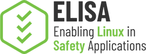

## ELISA Space Grade Linux Special Interests Group

The goal of the group is to advance space technology innovation and competitiveness by developing a common Linux distribution that can be used in space applications, ready for the challenges of deep space, often long lifespan robotic or human-based missions. The nature of space missions brings many challenges, from development to deployment there are multiple considerations that need to be considered. Furthermore this group is the initial step towards creating an ecosystem of supported platforms and a community that benefits from them, and also from the open source nature of the project. (https://lists.elisa.tech/g/space-grade-linux/)

# Minutes

## 20 August, 2026

# Agenda

- Roll Call
- Brief Notices
- Announcements
  - Upcoming Events
- Main Topic: The Space Grade Linux Foundation Pitch
  - Where we are on the path to a standalone project
  - The ask: referrals and leads for founding membership
- Mailing List Highlights
- Technical Topics
  - Roadmap Discussion (continued)
- Action Items Review
- Open Discussion / AOB
- Closing

---

# Roll Call

## Attended this meeting

- Ramon Roche (Dronecode Foundation)
- Ivan Perez (KBR @ NASA Ames Research Center)
- Alexey Simonov (TII / UAE)
- Leonidas Kosmidis (Barcelona Supercomputing Center)
- Nick Zajerko-McKee (Vorago Technologies)
- Philip Balister (OpenEmbedded)
- Eoin Dickson (Microchip)
- Brennan Hay (NASA GSFC)
- Subhajit Ghosh (Tweaklogic)
- Sandipan Ghosh (Tweaklogic)
- Ivan Pravdin (NVIDIA)
- Haoda Wang "Harry" (Columbia University & JPL)
- Cyril Jean (Microchip)
- Yasushi SHOJI (Space Cubics)
- Rob Woolley (Wind River)

## Attended recently in the past

- Alexey Simonov (TII)
- Brennan Hay (NASA GSFC)
- Brian Kempa
- Christopher Heistand
- Cyril Jean (Microchip)
- Dongshik Won (TelePIX, KAIST)
- Dhruv Sharma
- Douglas Landgraf (Red Hat)
- Gabriele Paoloni (Red Hat)
- Hans Weggeman (Wind River)
- Hugo Cornelis (Mind OSS)
- Ivan Perez (KBR @ NASA Ames Research Center)
- Ivan Pravdin (NVIDIA)
- Jan-Simon Moeller (AGL)
- Jan Vermaete
- Joe Speed (Ampere)
- Juan Solano
- Kate Stewart (LF)
- Leonidas Kosmidis (Barcelona Supercomputing Center)
- Lukas Mazl (Technical University of Liberec)
- Maciej Nowak (KP Labs)
- Manuel Beltran (Boeing)
- Martin Halle (TUHH)
- Matt Weber (The Boeing Company)
- Michael Krasnyk (The Exploration Company)
- Michael Mahoney (Wind River)
- Michael Monaghan (NASA GSFC)
- Michael Starch (JPL)
- Naga (Timesys/Lynx)
- Naoto Yamaguchi (AISIN)
- Nick Zajerko-McKee (Vorago Technologies)
- Panos Kalorog (NRB)
- Paul Greenwood (Vorago Technologies)
- Pawel Wodnicki (32bitmicro)
- Pedro Roque (Caltech)
- Philip Balister (OpenEmbedded)
- Rahn Twitchell (Tuxera)
- Ryo Takakura
- Shefali Sharma
- Subhajit Ghosh (Tweaklogic)
- Tim Bird (Sony)
- Tony James (Red Hat)
- Tyler Kwolek
- Yasushi SHOJI (Space Cubics)

---

# Brief Notices

## Code of Conduct and Legal Notices

- ELISA Project meetings involve participation by industry competitors, and it is the intention of the Linux Foundation to conduct all of its activities in accordance with applicable antitrust and competition laws. It is therefore extremely important that attendees adhere to meeting agendas, and be aware of, and not participate in, any activities that are prohibited under applicable US state, federal, or foreign antitrust and competition laws.
  - [Linux Foundation Antitrust Policy](http://www.linuxfoundation.org/antitrust-policy)
- Email communication will be treated as documentation and be received and made available by the Project under the [Creative Commons Attribution 4.0 International License](http://creativecommons.org/licenses/by/4.0). Please refer to the ELISA Technical Charter section 7 subsection iv. for details.
- The discussions in these meetings are exploratory. The opinions expressed by participants are not necessarily the policy of the companies.
- No recordings of working group meetings are permitted. Special provisions may be arranged for recording in advance with explicit consent of the participants.
- The kernel and LF Code of Conduct applies to all communication with this project
  - [Linux Foundation Code of Conduct](https://www.linuxfoundation.org/code-of-conduct/)
  - Linux [Contributor Covenant Code of Conduct](https://git.kernel.org/pub/scm/linux/kernel/git/torvalds/linux.git/tree/Documentation/process/code-of-conduct.rst)
  - Linux Kernel Contributor Covenant [Code of Conduct Interpretation](https://git.kernel.org/pub/scm/linux/kernel/git/torvalds/linux.git/tree/Documentation/process/code-of-conduct-interpretation.rst)

---

## Upcoming Events

- **Sept 13-17** ICAS Congress in Sydney, Australia -> [link](https://icas2026.com/)
- **Sept 13-17** DASC Congress in Orlando, USA -> [link](https://dasconline.org/2026/)
  - Our AeroWG paper got accepted
- **Sept 22-24** ROScon in Toronto -> [link](https://roscon.ros.org/2026/)
- **Oct 6-8** Open Source Summit EU in Prague -> [Link](https://events.linuxfoundation.org/open-source-summit-europe/)
- **Oct 2026** High Integrity Systems Conference [Link](https://www.his-conference.co.uk/)
- **NASA SPARK** submissions -> [link](https://spark.nasa.gov/)

---

# Main Topic: The Space Grade Linux Foundation Pitch

Ramon presents the founding member pitch for Space Grade Linux as a standalone, funded Linux Foundation project.

## Where we are

- Technical charter is finalized and governance docs (CONTRIBUTING, MAINTAINERS) are merged
- Founding member outreach is ongoing and the response remains encouraging
- Next milestone is closing the inaugural group of founding members so we can announce the launch

## The pitch

- Why a standalone project: dedicated funding unlocks paid infrastructure and CI, neutral governance under the LF, marketing and events, and a home the space industry can build on long term
- What founding members get: a seat at the table shaping governance and roadmap from day one, recognition at launch, and the visibility that comes with it
- Open to organizations of any size; exploring costs nothing and carries no commitment

## The ask for this group

1. **Referrals inside your own company.** You know SGL is worth backing; help us reach the person who can say yes. Point us to your OSPO, engineering leadership, or whoever owns open source membership decisions, and make the intro. Ramon handles everything from there.
2. **Leads beyond this room.** Which companies, agencies, primes, and suppliers should be at this table but are not here yet? Names and warm intros are both welcome, live during the call or 1:1 afterwards.

Every conversation can be confidential. Reach out to Ramon directly at rroche@linuxfoundation.org to set up a 1:1, ask questions, or pass along a lead.

---

# Mailing List Highlights

-

---

# Technical Topics

## Roadmap Discussion (continued)

Continuing the roadmap RFC. The thread remains open for additional input.

**Proposals for Roadmap:**
* Minimal System Layer, stripped down and usable out of the box
  * Documenting what's in the build, and why.
  * Run a hello world example, and trace down. Workload Tracing for the Linux Kernel (covers full kernel + userspace view)
    * See https://www.kernel.org/doc/html//v6.9/admin-guide/workload-tracing.html
    * [ELISA Subsystem trace research](https://github.com/elisa-tech/ELISA-White-Papers/blob/master/Processes/Discovering_Linux_kernel_subsystems_used_by_a_workload.md)
  * Aerospace is working a minimal practice activity with docs, [background here on end user goals](https://github.com/elisa-tech/wg-aerospace/issues/168#issuecomment-4183867886)
* Stress and do analysis on partitions on workloads, with [stress-ng](https://github.com/ColinIanKing/stress-ng)
* CI all the way to hardware, make sure we are verifying hardware runs builds
* Storage and persistence workstream, including a power-interruption test profile (follow-up from the July Tuxera talk)

---

# Action Items Review (from Jul 23)

- Rob Woolley: integrate the new Yocto LTS release (Wrynose) into SGL CI
- Ramon: follow up with Matt Weber on adding a Space workload example to the roadmap
- Group: evaluate FTRFS and ZFS for SGL inclusion, including licensing implications and hardware fault-tolerance baseline assumptions
- Ramon: chase remaining doc relicensing approvals (CC-BY-SA-4.0 -> CC-BY-4.0) from Matthias Schmitz and Celeste
- Roadmap: draft Minimal System Layer proposal, documenting what's in the build and why
- Roadmap: scope partition stress/analysis work using stress-ng
- Roadmap: define plan for CI all the way to hardware (verify builds run on target)

---

# Open Discussion / AOB

-

---

# Closing

## Action Items

-

Tracked in [GitHub Issues](https://github.com/elisa-tech/sig-sgl/issues)

## Next Meeting

- 17 September, 2026
