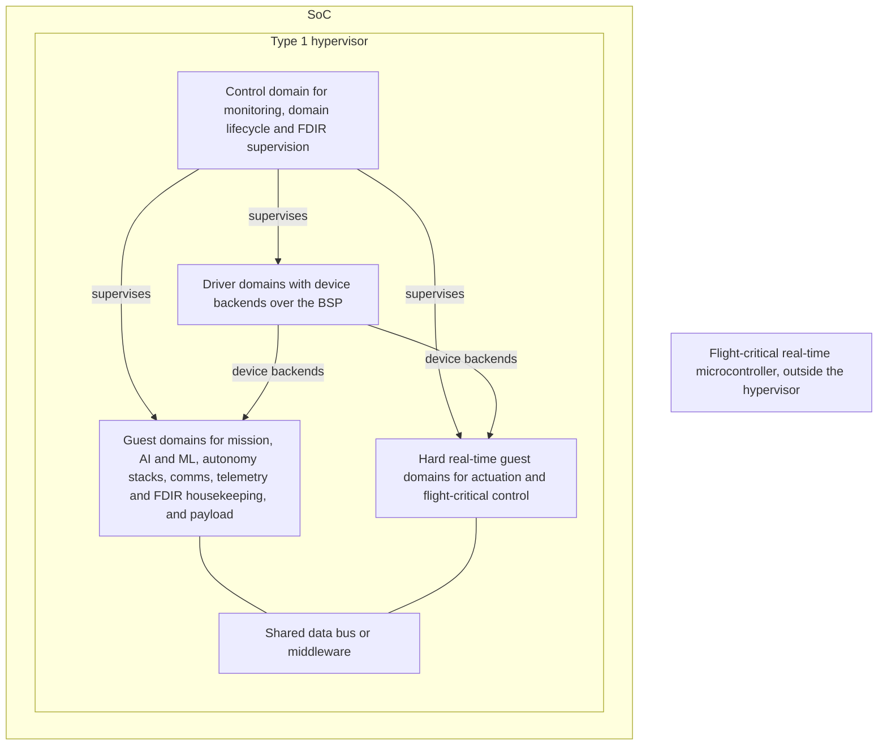

# RFC-0001: Software-defined vehicle architecture for space systems

## Summary

I propose an SDV for Space Architecture WG to define a reference architecture for software-defined space vehicles: one platform running a type 1 hypervisor, a control domain, driver domains, and guest domains that run Linux, other general-purpose operating systems, or an RTOS (for example Zephyr, TRON, RTEMS or FreeRTOS), together with the interfaces between them. The architecture is OS-agnostic and hardware-agnostic: it sets requirements on domains and on the hardware underneath them, and the WG defines which hypervisors, operating systems, RTOSes and middleware it supports and which reference hardware its prototypes use. I propose it because this is the direction the industry is heading, from Automotive Grade Linux's [SoDeV][agl-sodev] and SOAFEE ([November 20, 2025 minutes][m1120]) to the Boeing and AMD Xen functional safety work ([June 18, 2026 minutes][m0618]) and the 16 of 46 respondents to the SGL Interest Survey who already use a hypervisor, and because going beyond Linux is the right move for modern workflows. SGL builds one prototype implementation, on QEMU first and then on reference hardware the WG picks, to validate the architecture, not to define it. I ask the Technical Steering Committee (TSC) to charter the WG, adopt the role-level architecture sketch in this RFC, adapted from the AGL SoDeV reference architecture, as the seed of architecture v0.1, and authorize the WG to propose liaisons to the communities whose work it builds on.

## Motivation

My position, stated in the Summary, is that this is the direction the industry is heading and that going beyond Linux is the right move for modern workflows; the evidence follows. Without a shared definition, I expect each team to define the domains and the interfaces between them on its own; a shared, open definition would let them reuse each other's work instead.

### Where the industry is heading

- **Automotive has a reference platform.** Automotive Grade Linux, a sister Linux Foundation project on the same Yocto base, released SoDeV, a software-defined vehicle reference platform, in December 2025 ([announcement][agl-sodev]). The October 2025 project meeting noted that "AGL started with an architecture document, then transitioned to a reference distribution" ([October 16, 2025 minutes][m1016]). This RFC proposes the same order.
- **SOAFEE.** A participant raised [SOAFEE][soafee] at the [November 20, 2025 meeting][m1120], describing it as automotive companies "developing open source functionally safe containers & hypervisors" and noting that it is Yocto-based. The minutes note that "SOAFEE might have base images that could be used and extended with an additional meta-sgl specific package feed".
- **Hypervisors for mixed criticality in aerospace.** Boeing and AMD presented their [Xen][xen] functional safety work, covering aerospace, mixed criticality and mixed function, at the ELISA workshop in London, June 9 to 11, 2026 ([April 16][m0416] and [June 18, 2026 minutes][m0618]).
- **Partitioned flight software moving to Linux.** At the [May 21, 2026 meeting][m0521], CNES presented KOSMOS, its ECSS-B qualified flight software framework with time and space partitioning on the XNG hypervisor (Fentiss) and the LithOS RTOS. CNES plans a Yocto-based Linux partition in KOSMOS, "relying on poky, and potentially SGL", then an application manager ("smartphone in orbit"), then full Linux-based flight software with multi-policy hierarchical scheduling for containerized space apps.
- **Processors built for it.** Space processors are being designed for virtualization plus real-time operation. One example is Microchip's PIC64-HPSC family: eight SiFive X280 64-bit RISC-V cores "supporting virtualization and real-time operation", with dual-core lockstep modes ([Microchip press release, July 9, 2024][hpsc-pr]).
- **Survey respondents already build this way.** In the SGL Interest Survey, 46 responses, September 2024 to January 2026, 16 of 46 respondents (35 percent) use a hypervisor, 28 percent run mixed-criticality systems on different cores, 20 percent use ARINC 653 scheduling and 13 percent a separation kernel. One write-in: "SEL4 / QNX often used to provide separation kernel / mixed criticality support with Linux isolated to non safety critical applications". Another: "critical systems on separate hardware and firmware". Percentages in this RFC are of 46 respondents; the questions are multi-select, so they do not sum to 100 percent.

### Going beyond Linux, for modern workflows

Linux is the right operating system for many domains on a spacecraft, and SGL exists to make it better at that. It is not the right operating system for every domain. Respondents describe systems that keep safety-critical functions on a separation kernel, an RTOS or separate hardware, and isolate Linux next to them. A reference architecture that stops at Linux would describe one domain of those systems and leave the rest, and the interfaces between them, to each team.

- **RTOSes are already on board.** Of 46 respondents, 28 percent run FreeRTOS on target, 15 percent RTEMS, 13 percent Zephyr and 11 percent QNX, plus VxWorks and NuttX write-ins; one write-in says Zephyr "is about to replace (or initially at least supplement) FreeRTOS". A participant asked in the meeting chat in October 2025, "could we include Zephyr RTOS?", noting that "many spacecraft use an RTOS anyway" ([October 16, 2025 minutes][m1016]). [Zephyr][zephyr], [TRON][tron], RTEMS and FreeRTOS are examples of RTOSes a control or real-time domain may run; the architecture does not pick one.
- **Flight stacks vary.** Of 46 respondents, 24 percent use cFS, 13 percent F Prime, 13 percent Space ROS and 2 percent KubOS, and 34 of 46 (74 percent) answered "other", mostly custom or in-house frameworks. That spread argues for an architecture defined by domain roles and interfaces, not around any one flight stack. One respondent put it in a closing comment: "A payload computer role doesn't look the same as a primary flight computer."
- **Modern workflows cross domain boundaries.** Of 46 respondents, 63 percent use a container manager and 24 percent Kubernetes, with k3s, namespace and cgroup prototypes, and chroot among the write-ins. Remote updates are an interest area for 70 percent of 46 respondents. In the same chat, the participant also asked about "an immutable-OS approach like Fedora Silverblue / Fedora CoreOS" ([October 16, 2025 minutes][m1016]). Containers, remote updates, app managers and CI that builds and tests each domain image all work across domains only if the domains and the interfaces between them are defined.
- **Hardware and workloads vary.** Of 46 respondents, 83 percent need ARM, 35 percent RISC-V, 33 percent Intel, and 13 percent each PowerPC and SPARC. Among AI/ML libraries, 39 percent of 46 respondents plan or use OpenCV, 30 percent PyTorch, 30 percent the Nvidia stack and 22 percent TensorFlow. No single board or instruction set covers them, so the architecture sets requirements on hardware instead of naming a board.

### A role-level sketch, adapted from AGL SoDeV

I adapted the diagram below for space from the AGL SoDeV reference architecture diagram ([AGL SoDeV announcement][agl-sodev]). It names roles, not products, because the WG, not this RFC, decides which hypervisors, operating systems, RTOSes (for example Zephyr, TRON, RTEMS or FreeRTOS) and middleware implement them.

In this sketch, actuation and flight-critical control sit in the hard real-time guest domains, and FDIR supervision sits in the control domain. The WG confirms or changes that split. The device interface between domains is for the WG to define; VirtIO is a candidate the WG evaluates (see Interfaces below). The sketch is a proposal, not a decision, and I ask the TSC to adopt it as a seed, not as the answer (decision 2).

### Building blocks already discussed in project meetings

- **meta-virtualization.** Discussed at the [February 19, 2026 meeting][m0219] after a talk at the OpenEmbedded Workshop 2026 in Brussels ([meta-virtualization][metavirt]). Wrynose, the new Yocto LTS, brings "the latest meta-virtualization", and adding Wrynose to SGL CI is an open action item ([July 23][m0723] and [August 20, 2026 minutes][m0820]).
- **Updates.** The [October 16, 2025][m1016] [RAUC][rauc] discussion covered A/B updates, which write to an inactive partition and then reboot, and noted that RAUC's streaming currently requires TCP and can resume after an abort, which matters over space links.
- **Flight stacks.** meta-sgl already carries Space ROS Jazzy kas variants (2025.10, 2026.04, 2026.07), and the ELISA Aerospace WG publishes a [cFS demo build][cfs], raised at the [November 20, 2025][m1120] and [June 18, 2026][m0618] meetings. These are applications a guest domain hosts, not parts of the architecture.

## Proposal

I propose that the SDV for Space Architecture WG produce four things: an architecture, interface definitions, prototype implementations, and a standards track. The first deliverable is architecture v0.1, seeded by the role-level sketch above.

### 1. Architecture v0.1

Architecture v0.1 covers domain roles, isolation requirements, the failure and recovery model, the update model, and the hardware requirements the architecture places on a platform. The strawman roles:

| Role | Responsibilities |
|---|---|
| Control domain | Monitoring, boot, watchdog, domain lifecycle, FDIR supervision, domain health telemetry |
| Driver domains | Own physical devices; device backends over the BSP for buses and storage |
| Hard real-time guest domains | Actuation and flight-critical control on the SoC |
| Guest domains | Mission, payload and instrument control, AI/ML, autonomy stacks, comms, telemetry and FDIR housekeeping |
| Flight-critical microcontroller | Flight-critical real-time functions outside the hypervisor's failure domain |

The architecture names roles, not operating systems. Guest roles run in general-purpose OS domains (Linux or others) or in RTOS domains; control and hard real-time domains may run an RTOS (for example Zephyr, TRON, RTEMS or FreeRTOS), a general-purpose OS with real-time support, or bare metal, as long as each domain meets its role's isolation and timing requirements. For each role, v0.1 specifies:

- **Isolation requirements.** Time partitioning (CPU allocation and scheduling), space partitioning (memory protection, and interference through shared caches and memory bandwidth), and I/O ownership: every device is owned by exactly one domain, and other domains reach it only through the inter-domain device interface. The WG defines how interference between domains is measured.
- **Failure and recovery model.** Per-domain restart without a platform reset where the hardware allows it; a watchdog hierarchy (the hardware watchdog supervises the control domain, which supervises the other domains); a defined safe state per role; and domain health telemetry.
- **Update model.** A/B or golden/main slots per domain, building on the RAUC discussion of [October 2025][m1016] and the golden/main and A/B schemes recorded in the [April 16, 2026 minutes][m0416]. Remote updates are an interest area for 70 percent of 46 respondents.
- **Hardware requirements.** What a platform must provide for the architecture to hold: virtualization support for a type 1 hypervisor, memory protection that keeps each domain inside its own memory, I/O isolation so a device assigned to one domain cannot reach another domain's memory, and hardware watchdogs. The architecture defines requirements on hardware, not a board. Watchdogs are already in use by 65 percent of 46 respondents.

### 2. Interfaces

- **Inter-domain device interface.** The WG defines the standard device interface between domains. VirtIO is a candidate the WG evaluates. Whatever the WG defines has to cover what space buses need, such as SpaceWire, CAN, UART, SPI and GPIO; one survey write-in asks for drivers for "GPIOs, I2C, SPI, UART, PCI, SERDES, CAN, USB, Ethernet, SpaceWire". Where a device type is missing from an existing standard, the WG proposes it upstream to that standard's maintainers (for VirtIO, the OASIS VIRTIO Technical Committee) instead of defining its own devices.
- **Data bus and middleware position.** The WG defines where a shared data bus sits in the architecture, what domains can expect from it, and whether and on what criteria to recommend middleware. This RFC names no middleware. With 74 percent of 46 respondents on "other" flight software, the architecture cannot assume any one stack's bus.
- **Control-plane API for domain lifecycle.** Start, stop, restart, update and query health for each domain, exposed to ground and mapped to PUS-style services.
- **Health telemetry.** Per-domain health: restarts, watchdog events, and CPU and memory use. The format may share the results schema defined in RFC-0002 (radiation fault injection), so a domain restart in orbit and one in a fault campaign look the same to the tools that read them. If it does, the SDV for Space Architecture WG defines the domain health fields together with the CI Testing WG, which owns that schema under RFC-0002. In the SGL prototype, the sgl-telemetry-collect work for EDAC and system data (meta-sgl PR #44, draft, listed in the [May 21, 2026 minutes][m0521]) is a starting point.

### 3. Prototype implementations

- SGL provides one prototype implementation: an `sdv` family of kas configurations in [meta-sgl][meta-sgl] ([kas][kas]), following the repo's existing kas naming, that builds a hypervisor, a control domain, a driver domain and at least two guest domains (one hard real-time, one mission), with the components the WG selects.
- The prototype runs on QEMU first; meta-sgl already builds `qemuarm64`, `qemuriscv64` and `qemux86-64`. It then runs on whatever reference hardware the WG chooses, for example boards SGL already builds for, or boards in the rack proposed in RFC-0003 (hardware in the loop). Reference hardware exists only to prototype implementations.
- The prototype builds on upstream layers, such as [meta-virtualization][metavirt], without forking them; changes go upstream. Its Yocto base follows the LTS direction set in RFC-0004 (long-term support).
- meta-sgl CI builds the `sdv` configurations like any other target. Prototype images can boot in the RFC-0003 rack like any other image, and fault campaigns under RFC-0002 (radiation fault injection) can target them.
- Prototypes validate the architecture; they do not define it. Other implementations can conform: a vendor's own distribution, a different hypervisor, a guest OS other than Linux, or a Linux partition on a hypervisor SGL does not build.

### 4. Standards track

- Publish an "SDV for Space Reference Architecture" under CC-BY-4.0 (Technical Charter, section 7), versioned, with a self-assessed conformance checklist. Strawman for v0.1: a system conforms if it documents its domains by role, gives every device a single owning domain, exposes domain lifecycle through the control-plane API, emits domain health telemetry, and defines update and recovery per domain. There is no certification program.
- Liaisons follow decision 3. The WG proposes liaisons under Technical Charter section 2.g.v to relevant hypervisor, operating system, RTOS (for example Zephyr, TRON, RTEMS or FreeRTOS), middleware and software-defined vehicle communities, and the TSC confirms each one. A liaison carries the architecture's requirements to that community and brings its changes back, so the architecture builds on their work instead of forking it.
- Invite agencies, CNES and ESA among them, to review v0.1 against ECSS partitioning expectations ([ECSS][ecss]). ESA representatives already take part in the ELISA working group ([list message #184][l184]).
- How partitioning claims are evidenced is the subject of RFC-0005 (certification baseline). The WG works with the Assurance and Certification WG (RFC-0005) on what the architecture document must state so adopters can evidence partitioning and mixed-criticality claims.

## Scope and non-goals

In scope: domain roles, isolation, recovery and update model, and the hardware requirements on a platform; interface definitions; at least one prototype implementation; the published reference architecture and its conformance checklist; liaisons proposed under decision 3.

Non-goals:

- Selecting or prescribing hypervisors, operating systems, RTOSes (Zephyr, TRON, RTEMS, FreeRTOS or others), middleware or hardware. The WG defines the selection criteria and any supported set.
- Certifying anything. Certification evidence for adopters is the subject of RFC-0005 (certification baseline).
- Defining flight software frameworks. cFS, F Prime, Space ROS and in-house frameworks stay with their own projects; prototypes host them as guests.
- Ground segment software.
- Forking upstream projects, or writing a new hypervisor, operating system, RTOS or middleware.
- Resourcing: how this work is resourced is outside this RFC.

## Working group

**Name:** SDV for Space Architecture WG, created by the TSC under Technical Charter section 2.g.iv.

**Charter:** The WG defines and maintains an OS-agnostic, hardware-agnostic reference architecture for multi-domain space systems: the domain roles; their isolation, recovery and update requirements; the hardware requirements on a platform; and the interfaces between domains (device interface, data bus position, control-plane API and health telemetry). It defines which hypervisors, operating systems, RTOSes (for example Zephyr, TRON, RTEMS or FreeRTOS) and middleware the architecture supports and its prototypes use, the criteria for choosing them, and the reference hardware for prototyping. It maintains the SGL prototype (the `sdv` kas configurations in meta-sgl), publishes the reference architecture and its conformance checklist under CC-BY-4.0, proposes liaisons to the TSC under charter section 2.g.v, and runs the agency review round. It works with the CI Testing WG on the domain health fields (RFC-0002), with the LTS and Release Engineering WG on the Yocto base of the SGL prototype (RFC-0004), and with the Assurance and Certification WG on what the architecture document must state for partitioning and mixed-criticality claims (RFC-0005). It reports to the TSC.

**Cadence:** set by the WG at its first meeting. Meetings are open to anyone, and notes go in this repository next to the project meeting minutes.

**Chair:** to be elected by the working group at its first meeting, confirmed by the TSC.

### Deliverables and timeline (proposed)

- Architecture v0.1 document
- Interface definitions
- Conformance checklist
- At least one prototype implementation
- An agency review round of v0.1

The working group defines its own timeline. It holds its first meeting in the first quarter of 2027, elects its chair and publishes a quarterly plan; each quarter it reports progress to the TSC and publishes the next quarter's plan.

## Decision requested

The TSC decides by consensus, or by a vote under charter section 3.

1. Charter the SDV for Space Architecture WG under charter section 2.g.iv.
2. Adopt the role-level architecture sketch in this RFC, adapted from the AGL SoDeV reference architecture, as the seed of architecture v0.1, not as the answer.
3. Authorize the SDV for Space Architecture WG to propose liaisons under charter section 2.g.v to relevant hypervisor, operating system, RTOS, middleware and software-defined vehicle communities, each confirmed by the TSC.

## References

Related RFCs:

- RFC-0002 (radiation fault injection): health telemetry may share its results schema, with the domain health fields defined together with the CI Testing WG; its fault campaigns may target prototype images.
- RFC-0003 (hardware in the loop): prototype images may boot in its rack like any other image.
- RFC-0004 (long-term support): the Yocto base of the SGL prototype follows the LTS direction set there.
- RFC-0005 (certification baseline): evidence for partitioning and mixed-criticality claims, and what the architecture document must state for them.
- The SGL RFC process: [README.md](README.md).

Project and governance:

- Space Grade Linux Technical Charter, sections 2.g.iv, 2.g.v, 3 and 7.
- meta-sgl: [github.com/elisa-tech/meta-sgl][meta-sgl]

Survey:

- SGL Interest Survey, 46 responses, September 2024 to January 2026.

Project meeting minutes:

- [October 16, 2025][m1016]: Zephyr and immutable-OS questions, RAUC and A/B updates, AGL precedent
- [November 20, 2025][m1120]: SOAFEE, cFS demo build
- [February 19, 2026][m0219]: meta-virtualization
- [April 16, 2026][m0416]: Boeing and AMD Xen talk announced; golden/main and A/B update schemes
- [May 21, 2026][m0521]: KOSMOS talk; meta-sgl PR #44 (sgl-telemetry-collect)
- [June 18, 2026][m0618]: ELISA London workshop recap; cFS demo build
- [July 23, 2026][m0723]: Wrynose and the latest meta-virtualization
- [August 20, 2026][m0820]: Wrynose CI action item

Mailing lists:

- [space-grade-linux message #184][l184]: ESA on ECSS and DO-178, April 12, 2026

External:

- [AGL SoDeV announcement][agl-sodev]: the reference architecture the role-level sketch is adapted from
- [SOAFEE][soafee]
- [Xen Project][xen]
- [Zephyr Project][zephyr]; [TRON][tron]
- [Microchip press release, July 9, 2024][hpsc-pr]
- [meta-virtualization][metavirt]
- [ELISA Aerospace WG cFS demo build][cfs]
- [kas][kas]; [RAUC][rauc]; [ECSS][ecss]

[m1016]: ../meeting-minutes/project/ELISA-SGLSIG-Meeting-20251016.md
[m1120]: ../meeting-minutes/project/ELISA-SGLSIG-Meeting-20251120.md
[m0219]: ../meeting-minutes/project/ELISA-SGLSIG-20260219.md
[m0416]: ../meeting-minutes/project/ELISA-SGLSIG-20260416.md
[m0521]: ../meeting-minutes/project/ELISA-SGLSIG-20260521.md
[m0618]: ../meeting-minutes/project/ELISA-SGLSIG-20260618.md
[m0723]: ../meeting-minutes/project/ELISA-SGLSIG-20260723.md
[m0820]: ../meeting-minutes/project/ELISA-SGLSIG-20260820.md
[l184]: https://lists.elisa.tech/g/space-grade-linux/message/184
[hpsc-pr]: https://www.globenewswire.com/news-release/2024/07/09/2910141/0/en/Microchip-Unveils-Industry-s-Highest-Performance-64-bit-HPSC-Microprocessor-MPU-Family-for-a-New-Era-of-Autonomous-Space-Computing.html
[metavirt]: https://git.yoctoproject.org/meta-virtualization
[agl-sodev]: https://www.linuxfoundation.org/press/agl_sodev
[soafee]: https://www.soafee.io
[xen]: https://xenproject.org/
[zephyr]: https://www.zephyrproject.org/
[tron]: https://www.tron.org/
[cfs]: https://github.com/elisa-tech/wg-aerospace/blob/main/demos/docs/Build-cFS.md
[meta-sgl]: https://github.com/elisa-tech/meta-sgl
[kas]: https://kas.readthedocs.io/
[rauc]: https://rauc.io/
[ecss]: https://ecss.nl/
