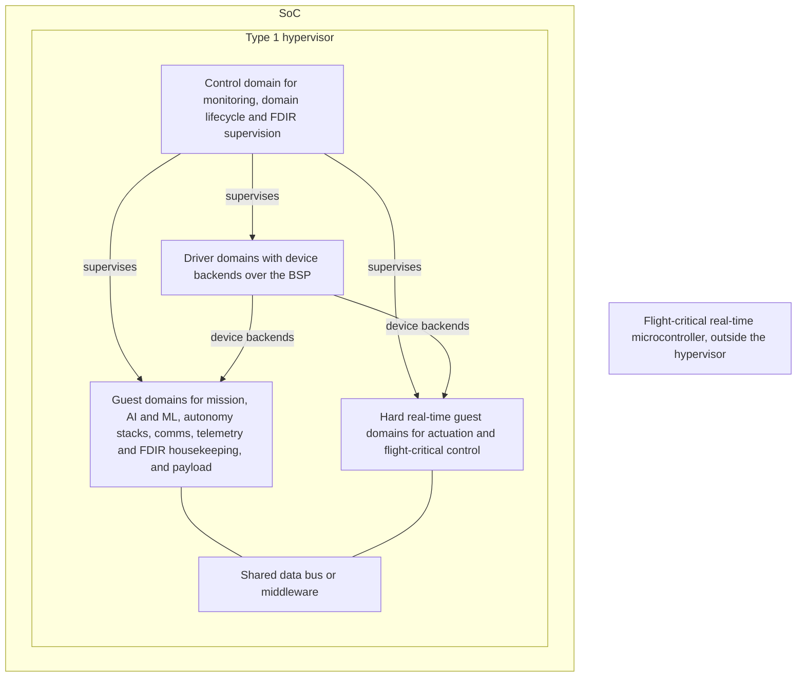

# RFC-0001: Software-defined vehicle architecture for space systems

## Summary

I propose an SDV for Space Architecture WG to define an open reference architecture for software-defined space vehicles: one platform hosting isolated domains that run Linux, other general-purpose operating systems, or an RTOS (for example Zephyr, TRON, RTEMS or FreeRTOS), defined by the roles of those domains and the interfaces between them, and tied to no single operating system, hypervisor or board. I propose it because this is the direction the industry is heading, from Automotive Grade Linux's [SoDeV][agl-sodev] and SOAFEE ([November 20, 2025 minutes][m1120]) to the Boeing and AMD Xen functional safety work ([June 18, 2026 minutes][m0618]) and the 16 of 46 respondents to the SGL Interest Survey who already use a hypervisor, and because going beyond Linux is the right move for modern workflows. This RFC gives the WG a goal, the evidence, starting points and the requirements its recommendation must meet; the WG, not this RFC, decides which hypervisors, operating systems, RTOSes, middleware and reference hardware the architecture supports, and whether and how to prototype it. I ask the Technical Steering Committee (TSC) to charter the WG, adopt the role-level architecture sketch in this RFC, adapted from the AGL SoDeV reference architecture, as the seed of architecture v0.1, not as the answer, and authorize the WG to propose liaisons to the communities whose work it builds on.

## Motivation

My view, stated in the Summary, is that this is the direction the industry is heading, that going beyond Linux is the right move for modern workflows, and that without a shared, open definition each team defines the domains and the interfaces between them on its own instead of reusing each other's work. The evidence follows.

### Where the industry is heading

- **Automotive has a reference platform.** Automotive Grade Linux, a sister Linux Foundation project on the same Yocto base, released SoDeV, a software-defined vehicle reference platform, in December 2025 ([announcement][agl-sodev]). The October 2025 project meeting noted that "AGL started with an architecture document, then transitioned to a reference distribution" ([October 16, 2025 minutes][m1016]).
- **SOAFEE.** A participant raised [SOAFEE][soafee] at the [November 20, 2025 meeting][m1120], describing it as automotive companies "developing open source functionally safe containers & hypervisors" and noting that it is Yocto-based. The minutes note that "SOAFEE might have base images that could be used and extended with an additional meta-sgl specific package feed".
- **Hypervisors for mixed criticality in aerospace.** Boeing and AMD presented their [Xen][xen] functional safety work, covering aerospace, mixed criticality and mixed function, at the ELISA workshop in London, June 9 to 11, 2026 ([April 16][m0416] and [June 18, 2026 minutes][m0618]).
- **Partitioned flight software moving to Linux.** At the [May 21, 2026 meeting][m0521], CNES presented KOSMOS, its ECSS-B qualified flight software framework with time and space partitioning on the XNG hypervisor (Fentiss) and the LithOS RTOS. CNES plans a Yocto-based Linux partition in KOSMOS, "relying on poky, and potentially SGL", then an application manager ("smartphone in orbit"), then full Linux-based flight software with multi-policy hierarchical scheduling for containerized space apps.
- **Processors built for it.** Space processors are being designed for virtualization plus real-time operation. One example is Microchip's PIC64-HPSC family: eight SiFive X280 64-bit RISC-V cores "supporting virtualization and real-time operation", with dual-core lockstep modes ([Microchip press release, July 9, 2024][hpsc-pr]).
- **Survey respondents already build this way.** In the SGL Interest Survey, 46 responses, September 2024 to January 2026, 16 of 46 respondents (35 percent) use a hypervisor, 28 percent run mixed-criticality systems on different cores, 20 percent use ARINC 653 scheduling and 13 percent a separation kernel. One write-in: "SEL4 / QNX often used to provide separation kernel / mixed criticality support with Linux isolated to non safety critical applications". Another: "critical systems on separate hardware and firmware". Percentages in this RFC are of 46 respondents; the questions are multi-select, so they do not sum to 100 percent.

### Going beyond Linux, for modern workflows

Respondents describe systems that keep safety-critical functions on a separation kernel, an RTOS or separate hardware, and isolate Linux next to them. A reference architecture that stops at Linux describes one domain of those systems and leaves the rest, and the interfaces between them, to each team.

- **RTOSes are already on board.** Of 46 respondents, 28 percent run FreeRTOS on target, 15 percent RTEMS, 13 percent Zephyr and 11 percent QNX, plus VxWorks and NuttX write-ins; one write-in says Zephyr "is about to replace (or initially at least supplement) FreeRTOS". A participant asked in the meeting chat in October 2025, "could we include Zephyr RTOS?", noting that "many spacecraft use an RTOS anyway" ([October 16, 2025 minutes][m1016]). [Zephyr][zephyr], [TRON][tron], RTEMS and FreeRTOS are examples of RTOSes for a control or real-time domain; this RFC does not pick one.
- **Flight stacks vary.** Of 46 respondents, 24 percent use cFS, 13 percent F Prime, 13 percent Space ROS and 2 percent KubOS, and 34 of 46 (74 percent) answered "other", mostly custom or in-house frameworks. That spread argues for an architecture defined by domain roles and interfaces, not around any one flight stack. One respondent put it in a closing comment: "A payload computer role doesn't look the same as a primary flight computer."
- **Modern workflows cross domain boundaries.** Of 46 respondents, 63 percent use a container manager and 24 percent Kubernetes, with k3s, namespace and cgroup prototypes, and chroot among the write-ins. Remote updates are an interest area for 70 percent of 46 respondents. In the same chat, the participant also asked about "an immutable-OS approach like Fedora Silverblue / Fedora CoreOS" ([October 16, 2025 minutes][m1016]). Containers, remote updates, app managers and CI that builds and tests each domain image all work across domains only when the domains and the interfaces between them are defined.
- **Hardware and workloads vary.** Of 46 respondents, 83 percent need ARM, 35 percent RISC-V, 33 percent Intel, and 13 percent each PowerPC and SPARC. Among AI/ML libraries, 39 percent of 46 respondents plan or use OpenCV, 30 percent PyTorch, 30 percent the Nvidia stack and 22 percent TensorFlow. No single board or instruction set covers them, so the architecture sets requirements on hardware instead of naming a board.

## Proposal

### Goal

The goal is an open reference architecture for software-defined space vehicles, defined by domain roles and the interfaces between them, that SGL and other implementations conform to: a vendor's own distribution, a different hypervisor, a guest OS other than Linux, or a Linux partition on a hypervisor SGL does not build. The architecture must be:

- **OS-agnostic.** It names roles, not operating systems. A domain in any role runs whatever general-purpose OS, RTOS or bare-metal software meets that role's isolation and timing requirements.
- **Hardware-agnostic.** It sets requirements on the hardware underneath the domains, not a board.
- **Built on upstream work.** It builds on existing hypervisor, operating system, RTOS and middleware projects without forking them; changes go upstream.
- **Open.** It is published as project documentation under CC-BY-4.0 (Technical Charter, section 7.b.iv).

### The seed: a role-level sketch

I adapted the diagram below for space from the AGL SoDeV reference architecture diagram ([AGL SoDeV announcement][agl-sodev]). It names roles, not products, because the WG, not this RFC, decides which hypervisors, operating systems, RTOSes and middleware implement them.

In this sketch, actuation and flight-critical control sit in the hard real-time guest domains, and FDIR supervision sits in the control domain. The sketch is a starting point, not a decision: the WG confirms or changes the roles and that split. I ask the TSC to adopt it as the seed of architecture v0.1, not as the answer (decision 2).

### Starting points

These are what the project already knows about. They are starting points, not a shortlist.

- **meta-virtualization.** Discussed at the [February 19, 2026 meeting][m0219] after a talk at the OpenEmbedded Workshop 2026 in Brussels ([meta-virtualization][metavirt]). Wrynose, the new Yocto LTS, brings "the latest meta-virtualization", and adding Wrynose to SGL CI is an open action item ([July 23][m0723] and [August 20, 2026 minutes][m0820]).
- **Updates.** The [October 16, 2025][m1016] [RAUC][rauc] discussion covered A/B updates, which write to an inactive partition and then reboot, and noted that RAUC currently requires TCP and can resume an update after an abort, which matters over space links. The [April 16, 2026 minutes][m0416] record golden/main and A/B update schemes.
- **Device interface.** VirtIO is one starting point for the device interface between domains. Its upstream for new device types is the OASIS VIRTIO Technical Committee.
- **Health telemetry.** sgl-telemetry-collect, for EDAC and system data (meta-sgl PR #44, draft, listed in the [May 21, 2026 minutes][m0521]).
- **Prototype hosting.** [meta-sgl][meta-sgl] already builds [kas][kas] configurations for `qemuarm64`, `qemuriscv64` and `qemux86-64` and for boards, and SGL can host a prototype.
- **Flight stacks.** meta-sgl already carries Space ROS Jazzy kas variants (2025.10, 2026.04, 2026.07), and the ELISA Aerospace WG publishes a [cFS demo build][cfs], raised at the [November 20, 2025][m1120] and [June 18, 2026][m0618] meetings.

### What the recommendation must address

The WG brings the TSC a recommendation: architecture v0.1, seeded by the sketch above. The recommendation comes back to the TSC for approval. This section says what it must cover; the answers are the WG's.

Architecture v0.1 must define:

- the domain roles, starting from the sketch;
- isolation for each role in time, memory and I/O, including how devices are owned and reached across domains, and how interference between domains is measured;
- the failure and recovery model: how a failed domain is detected, supervised and recovered, and the safe state of each role (watchdogs are already in use by 65 percent of 46 respondents);
- the update model for each domain;
- the hardware requirements a platform must meet for the architecture to hold, stated as requirements and not as a board;
- the device interface between domains, covering the buses space systems use (one survey write-in asks for drivers for "GPIOs, I2C, SPI, UART, PCI, SERDES, CAN, USB, Ethernet, SpaceWire");
- where a shared data bus or middleware sits and what domains can expect from it, given that 34 of 46 respondents (74 percent) answered "other" when asked which flight software stacks they use;
- the control-plane interface for domain lifecycle and health, including whether and how it is exposed to ground and whether it maps to PUS-style services;
- per-domain health telemetry: what each domain reports, and in what format;
- the criteria for choosing hypervisors, operating systems, RTOSes and middleware, and any supported set.

The recommendation must also address:

- whether and how to prototype the architecture, and on which reference hardware, knowing that a prototype validates the architecture and does not define it;
- how the architecture is published and versioned, and what it means for an implementation to conform;
- what the architecture document states so adopters, including those who certify products, can evidence partitioning and mixed-criticality claims;
- which standards' partitioning expectations the architecture is reviewed against, and whether and how agencies and adopters take part in that review: CNES's KOSMOS is ECSS-B qualified ([ECSS][ecss]), and ESA representatives already take part in the ELISA working group ([list message #184][l184]);
- which hypervisor, operating system, RTOS, middleware and software-defined vehicle communities to propose liaisons with under decision 3 (Technical Charter section 2.g.v), each confirmed by the TSC, and what each liaison does with that community.

## Scope and non-goals

In scope: the reference architecture (domain roles, isolation, failure and recovery, updates, hardware requirements and interfaces); the WG's recommendation on architecture v0.1, including whether and how to prototype it; publishing the architecture; liaisons proposed under decision 3.

Non-goals:

- Selecting or prescribing hypervisors, operating systems, RTOSes (Zephyr, TRON, RTEMS, FreeRTOS or others), middleware or hardware in this RFC. The WG defines the selection criteria and any supported set.
- Certifying anything. There is no certification program.
- Defining flight software frameworks. cFS, F Prime, Space ROS and in-house frameworks stay with their own projects.
- Ground segment software.
- Resourcing: how this work is resourced is outside this RFC.

## Working group

**Name:** SDV for Space Architecture WG, created by the TSC under Technical Charter section 2.g.iv.

**Charter:** The WG owns the reference architecture described in the Proposal. It brings the TSC architecture v0.1 as its recommendation, starting from the sketch in this RFC and meeting the requirements in the Proposal, then maintains and publishes the architecture the TSC approves. It proposes liaisons to the TSC under charter section 2.g.v and reports to the TSC.

**Cadence:** set by the WG at its first meeting.

**Chair:** to be elected by the working group at its first meeting, confirmed by the TSC.

### Deliverables and timeline (proposed)

- A recommendation to the TSC on architecture v0.1, covering the requirements in the Proposal
- The published reference architecture, under CC-BY-4.0
- Liaison proposals to the TSC under charter section 2.g.v

The working group defines its own timeline. It holds its first meeting in the first quarter of 2027, elects its chair and publishes a quarterly plan; each quarter it reports progress to the TSC and publishes the next quarter's plan.

## Decision requested

The TSC decides by consensus, or by a vote under charter section 3.

1. Charter the SDV for Space Architecture WG under charter section 2.g.iv.
2. Adopt the role-level architecture sketch in this RFC, adapted from the AGL SoDeV reference architecture, as the seed of architecture v0.1, not as the answer.
3. Authorize the SDV for Space Architecture WG to propose liaisons under charter section 2.g.v to relevant hypervisor, operating system, RTOS, middleware and software-defined vehicle communities, each confirmed by the TSC.

## References

Project and governance:

- The SGL RFC process: [README.md](README.md).
- Space Grade Linux Technical Charter, sections 2.g.iv, 2.g.v, 3 and 7.b.iv.
- meta-sgl: [github.com/elisa-tech/meta-sgl][meta-sgl]
- SGL Interest Survey, 46 responses, September 2024 to January 2026.

Project meeting minutes and mailing list:

- [October 16, 2025][m1016]: Zephyr and immutable-OS questions, RAUC and A/B updates, AGL precedent
- [November 20, 2025][m1120]: SOAFEE, cFS demo build
- [February 19, 2026][m0219]: meta-virtualization
- [April 16, 2026][m0416]: Boeing and AMD Xen talk announced; golden/main and A/B update schemes
- [May 21, 2026][m0521]: KOSMOS talk; meta-sgl PR #44 (sgl-telemetry-collect)
- [June 18, 2026][m0618]: ELISA London workshop recap; cFS demo build
- [July 23, 2026][m0723]: Wrynose and the latest meta-virtualization
- [August 20, 2026][m0820]: Wrynose CI action item
- [space-grade-linux message #184][l184]: ESA on ECSS and DO-178, April 12, 2026

External:

- [AGL SoDeV announcement][agl-sodev]: the reference architecture the role-level sketch is adapted from
- [SOAFEE][soafee]; [Xen Project][xen]; [Zephyr Project][zephyr]; [TRON][tron]
- [Microchip press release, July 9, 2024][hpsc-pr]; [meta-virtualization][metavirt]; [ELISA Aerospace WG cFS demo build][cfs]; [kas][kas]; [RAUC][rauc]; [ECSS][ecss]

[m1016]: ../meeting-minutes/project/ELISA-SGLSIG-Meeting-20251016.md
[m1120]: ../meeting-minutes/project/ELISA-SGLSIG-Meeting-20251120.md
[m0219]: ../meeting-minutes/project/ELISA-SGLSIG-20260219.md
[m0416]: ../meeting-minutes/project/ELISA-SGLSIG-20260416.md
[m0521]: ../meeting-minutes/project/ELISA-SGLSIG-20260521.md
[m0618]: ../meeting-minutes/project/ELISA-SGLSIG-20260618.md
[m0723]: ../meeting-minutes/project/ELISA-SGLSIG-20260723.md
[m0820]: ../meeting-minutes/project/ELISA-SGLSIG-20260820.md
[l184]: https://lists.elisa.tech/g/space-grade-linux/message/184
[hpsc-pr]: https://www.globenewswire.com/news-release/2024/07/09/2910141/0/en/Microchip-Unveils-Industry-s-Highest-Performance-64-bit-HPSC-Microprocessor-MPU-Family-for-a-New-Era-of-Autonomous-Space-Computing.html
[metavirt]: https://git.yoctoproject.org/meta-virtualization
[agl-sodev]: https://www.linuxfoundation.org/press/agl_sodev
[soafee]: https://www.soafee.io
[xen]: https://xenproject.org/
[zephyr]: https://www.zephyrproject.org/
[tron]: https://www.tron.org/
[cfs]: https://github.com/elisa-tech/wg-aerospace/blob/main/demos/docs/Build-cFS.md
[meta-sgl]: https://github.com/elisa-tech/meta-sgl
[kas]: https://kas.readthedocs.io/
[rauc]: https://rauc.io/
[ecss]: https://ecss.nl/
