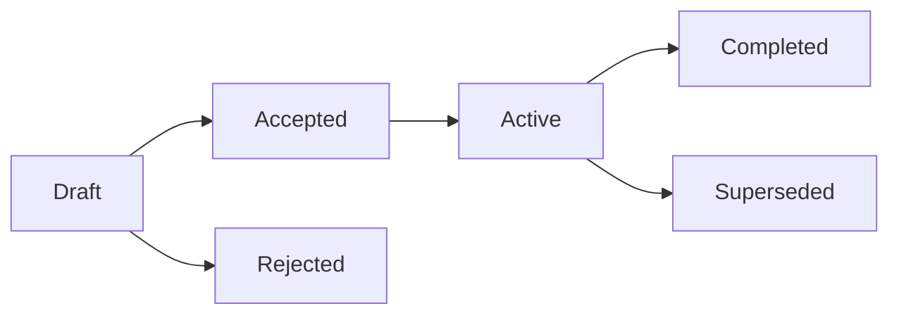

<!-- SPDX-License-Identifier: CC-BY-4.0 -->

# Space Grade Linux RFCs

A Request for Comment (RFC) is how Space Grade Linux (SGL) proposes, discusses and decides changes that are bigger than one pull request. This directory keeps every RFC, accepted or not, so the record of what the project decided and why stays in one place.

## When an RFC is required

Write an RFC when a proposal does at least one of these:

- affects more than one part of SGL (for example the layer, CI, release process and documentation together);
- creates a working group or changes the scope of an existing one;
- sets a norm the project will be held to, such as a support window, a certification claim or a reference architecture.

Everything else goes straight to a pull request in [meta-sgl](https://github.com/elisa-tech/meta-sgl). If you are unsure, ask on the [mailing list](https://lists.elisa.tech/g/space-grade-linux/) before writing one.

## Lifecycle

| Status | Meaning |
| --- | --- |
| Draft | The PR is open. The comment period runs for at least two project meetings or three weeks, whichever is longer. |
| Accepted | The TSC approved the RFC, by consensus or by a vote under section 3 of the Technical Charter. |
| Rejected | The TSC declined the RFC. It is still merged, with this status, so the reasoning stays on record. |
| Active | The working group or work the RFC created is running. |
| Completed | The deliverables are done. |
| Superseded | A later RFC replaced this one. The later RFC names it in its `supersedes` field. |

Status lives in the `status` field of the RFC frontmatter. The committer who merges the outcome sets it in the same pull request and updates the index below. Later transitions (Active, Completed, Superseded) are small pull requests that change only the status field and the index.

## How to comment

- Comment inline on the RFC file in the pull request, on the line you are talking about.
- Propose exact wording with GitHub's suggestion feature so the author can apply it in one click.
- Committers may push directly to the RFC branch for fixes and agreed edits.
- If you want a substantially different approach, describe it in a comment first so the author can fold it in, instead of opening a competing pull request.
- While an RFC is in Draft it is on the agenda of every public project meeting ([minutes](../meeting-minutes/project/)). Replies on the mailing list count too; the author summarizes them on the pull request.

## How it gets decided

The Technical Steering Committee (TSC) decides. The [Space Grade Linux Technical Charter](../CHARTER.md) makes the TSC responsible for "approving project or system proposals" (section 2.g.ii) and for "creating sub-committees or working groups to focus on cross-project technical issues and requirements" (section 2.g.iv).

Decisions follow section 3 of the charter. The TSC seeks consensus first. If a vote is needed, each voting member has one vote, quorum is 50 percent of voting members, and a decision needs a majority of those present at a meeting, or a majority of all voting members for an electronic vote. TSC voting members are the committers listed in [meta-sgl MAINTAINERS.md](https://github.com/elisa-tech/meta-sgl/blob/main/MAINTAINERS.md).

RFCs do not cover resourcing. Accepting an RFC approves a technical direction only.

## Numbering and file names

- RFC numbers have four digits. The author takes the next free number in the index below when opening the pull request.
- File name: `NNNN-short-slug.md`, lowercase, words separated by hyphens.
- Start from [0000-template.md](0000-template.md) and keep its frontmatter and section order.
- If two open pull requests pick the same number, the one merged later renumbers before merge.
- Commits are signed off (`git commit -s`), as everywhere else in the project.

## License

RFCs are project documentation and are licensed CC-BY-4.0, per section 7 of the Technical Charter. Every RFC says so in its frontmatter.

## Index

Each RFC pull request adds its own row.

| RFC | Title | Status | Discussion |
| --- | --- | --- | --- |
| [0001](0001-sdv-architecture-for-space.md) | Software-defined vehicle architecture for space systems | Draft | PR: pending |
